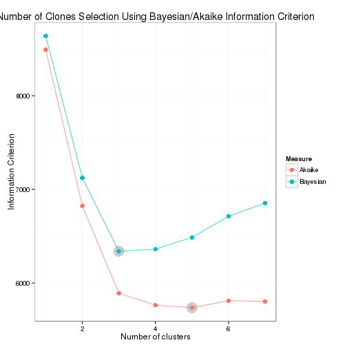
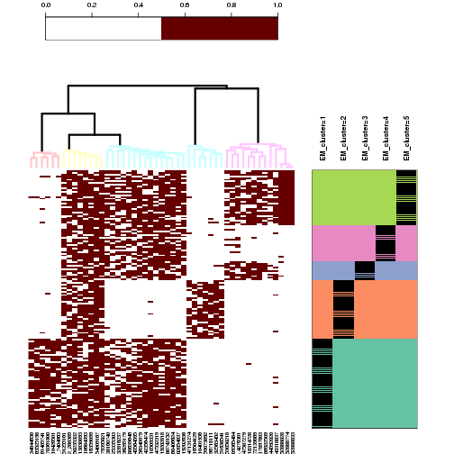
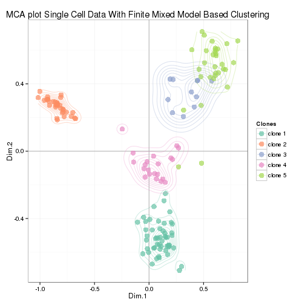
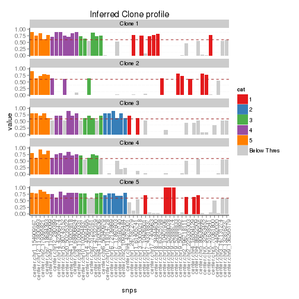
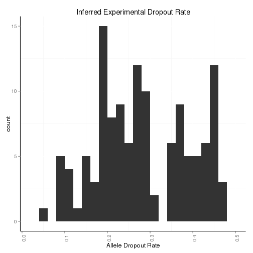
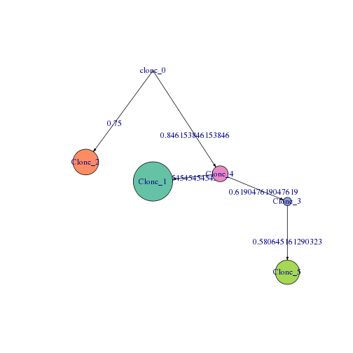

## Dissecting the Clonal Origins of Childhood Acute Lymphoblastic Leukemia By Single-Cell Genomics

The aim of this git repository is to provide an overview of the analysis published in the above titled paper in [PNAS](http://www.pnas.org). This analysis is only made possible by the hard work of all the other authors that generated the R packages listed below. Special thanks to authors of `flexmix` , `adegenet` & `FactoMineR` which drives most of the analysis pipeline and `ggplot2` , `heatplus` & `igraph` which drives all of the visualizations. The complete analysis framework, biological concept and applications  are greatly inspired by my advisor: [Stephen Quake](http://thebigone.stanford.edu/) and dear friend, Dr Charles Gawad.

###Key features:

* Finite Mixture Model based clusering of binary matrix of mutations using the `flexmix` package
* Using different information criterion for determing the number of clones 
* Inference of allele dropout rate from the model based clustering results
* Ploting functions for visualization of the clonal mutation profile using `ggplot2` package
* Heatmap visualizations with clonal annotations using `heatplus` package
* Multiple Correspondence analysis as an unsupervised method of infering clones from binary mutations matrix using `FactoMineR` package
* Generation of clonal tree using the `adegenet` and `igraph` package

### Required R packages for the analysis

```r
require(flexmix)          # For model based clustering
require(RColorBrewer)     # For color palettes in plotting
require(ggplot2)          # For plotting
require(FactoMineR)       # For performing MCA
require(vegan)            # For calculating jaccard distance
require(gplots)           # For plotting heatmaps
require(Heatplus)         # For plotting heatmaps with annotations
require(reshape)          # For melting dataframe
require(adegenet)         # For performing the Directed Minimum Spanning tree for clones
require(igraph)           # For plotting of trees 
require(knitr)            # For generating html docs
```

### Format of Input Data 
The input matrix consists of mainly 1 for the mutation being present and 0 for absent. There is an additional required last column named "clusters". This can be started off with random assignments or by manual annotation of clones so as to enable comparison later on with the clonal clusters that the model based clustering method produce. Shown below is a subset of an example input matrix:


| chr1_154909167| chr1_247587279| chr10_102054837| chr10_118314728| chr11_61405741| chr12_113830893| clusters|
|--------------:|--------------:|---------------:|---------------:|--------------:|---------------:|--------:|
|              1|              1|               0|               1|              0|               1|        1|
|              1|              0|               1|               0|              1|               1|        2|
|              0|              1|               0|               0|              0|               1|        3|
|              1|              0|               1|               0|              1|               0|        2|
|              1|              0|               1|               1|              1|               1|        1|
|              1|              0|               0|               0|              1|               1|        2|

### Running the Analysis - An Example 
The R script with all the functions to analyse the data is contained in the R-script in the repository. Here parts of code are shown to demonstrate the workflow:


We began with using the function to cast the input mutation matrix into a format that can be used with stepFlexmix function to perform the model based clustering. This function is performed for different number of clones define by k, below we ran it from 1 to 7 possible clones and at each step we repeat it 3 times till convergence. 


```r
###Patient 3--------
set.seed(10)
pt3_mb_clus.df  <- my_create_in_df(pt3_cluster)              # Creates the input for EM
pt3_fmm         <- stepFlexmix    (Incidence ~ 1,
                                   weights = ~ Freq, 
                                   data    = pt3_mb_clus.df,
                                   model   = FLXMCmvbinary(truncated = TRUE ),
                                   control = list         (minprior  = 0.005), 
                                   k       = 1:7, 
                                   nrep    = 3)              # Perform the model base clustering
```

Then to select for the optimal number of clones that best describe the data, we use the information criterion (AIC and BIC) plots 


```r
pt3_ic_plot     <- my_ic_fun      (pt3_fmm)                  # Generate Plots using Information Criterion
pt3_ic_plot                                                  # Do the actual plot
```



From the plot we select the number of clones that best describe the data and subsequently generate the clonal profiles


```r
nos_clones      <- 5                                         # Select the required number of clones from criterion plots
pt3_fmm_best    <- getModel       (pt3_fmm, nos_clones)      # Select the number of clones from diagnostic plots
pt3_params_melt <- my_params_df   (pt3_fmm_best)             # Get the Parameters of Best Model
pt3_pos.df      <- posterior      (pt3_fmm_best)             # Get the posterior probability for each cell
nos_row_hc      <- 5                                         # Number of hclust row clusters 
nos_mut         <- 5                                         # Number of mutations categories
pt3_heatmaps    <- my_heatmap     (pt3_cluster,pt3_fmm_best,
                                   nos_row_hc,nos_mut)       # Performs the heatmaps + jaccard dist clustering
```

Now, using the best model that describes the data. We use the heatmaps of the binary matrix to visualize the output of the model-based clustering


```r
plot(pt3_heatmaps[[1]])
```



To visualize the EM clustering in a different space, we plotted the single cell mutational data in Multiple Correspondance Analysis MCA space. In this space, each point represents a single cell and the color of the points corresponds to the different clones inferred from the model base clustering.


```r
pt3_MDS      <- my_MDS         (pt3_cluster,pt3_fmm_best) # Perform MCA on the binary data
pt3_gg_MCA_1 <- ggplot(data = pt3_MDS[[2]], aes(x = Dim.1, y = Dim.2, label = rownames(pt3_MDS[[2]]))) + 
  geom_hline    (yintercept = 0, colour = "gray70") + 
  geom_vline    (xintercept = 0, colour = "gray70") +
  geom_point    (aes(color  = factor(cluster_assign)), alpha = 0.7,size=4) +
  geom_density2d(aes(color  = factor(cluster_assign)), alpha = 0.3) +
  scale_colour_manual ( name   ="Clones", 
                        values = brewer.pal(nos_clones, "Set2"),
                        breaks = levels    (pt3_MDS[[2]]$cluster_assign),
                        labels = paste0    ("clone ",levels(pt3_MDS[[2]]$cluster_assign)))+
  ggtitle       ("MCA plot Single Cell Data With Finite Mixed Model Based Clustering") +
  theme_bw()
pt3_gg_MCA_1
```



At this stage, we are interested in what the are the mutations responsible for defining the clones and also visualize the consensus clonal profile.


```r
pt3_gg_clone_profile<-ggplot(pt3_params_melt,aes(x=snps,y=value,fill=cat))+
  geom_bar          (stat="identity")+
  geom_hline        (yintercept=0.6  , color="brown",linetype="dashed")+
  facet_wrap        ( ~ variable     , ncol=1)+
  ggtitle           ("Inferred Clone profile")+
  scale_fill_manual (values = c(brewer.pal (length(levels(pt3_params_melt$cat))-1,"Set1"),"grey80"))+
  theme(axis.text.x         = element_text (angle = 90, hjust = 1),
        panel.background    = element_blank(),
        axis.line           = element_line (colour = "black"))
pt3_gg_clone_profile
```



Now we can estimate the Allele Dropout Rate (ADO) from the different clonal profiles


```r
pt3_est_ado     <- median         (1-pt3_params_melt$value[  pt3_params_melt$value >  0.5 
                                                           & pt3_params_melt$value <= 1  ])

pt3_gg_ADO <- ggplot(subset(pt3_params_melt,value>0.5 & value <1),aes(x=1-value))+
  geom_histogram(binwidth = 0.02)+
  ggtitle       ("Inferred Experimental Dropout Rate")+
  xlab          ("Allele Dropout Rate") +
  theme(axis.text.x       = element_text (angle  = 90, hjust = 1),
        panel.background  = element_blank(),
        axis.line         = element_line (colour = "black"))

pt3_gg_ADO
```



We can then proceed to infer the relationship between the clones. 


```r
pt3_cl_geno   <- my_param_2_cl (pt3_fmm_best)
pt3_cl_sel    <- c(1,2,3,4,5)
pt3_pre_tree  <- my_pre_tree   (pt3_cl_geno[pt3_cl_sel,],
                                table(flexmix::clusters(pt3_fmm_best))[pt3_cl_sel],
                                primary=TRUE)
pt3_tree      <- my_run_tree   (pt3_pre_tree[[1]],
                                pt3_pre_tree[[2]])
```

Here we exploited the fact that clones with larger number of mutations younger and that they are derive from clones which are older that have less mutations. The height of the tree thus being with an ancestral clone, and based on the mutations that defines each of the consensus clone, we can draw the tree of relationship where the height of the tree can be interpreted to be the age of the clone from oldest ancestor at the top to the most recent clone at the bottom. The numbers of the edges of the trees reflects the jaccard distance between clones. 


```r
plot(pt3_tree[[1]],
     layout          = my_layout(pt3_tree[[1]], root=1),
     vertex.size     = c(1,as.vector(table(flexmix::clusters(pt3_fmm_best)))[pt3_cl_sel])*0.75,
     vertex.label    = rownames(pt3_tree[[2]]),
     vertex.color    = c("grey30",brewer.pal(length(rownames(pt3_cl_geno)),"Set2")[pt3_cl_sel]),
     edge.arrow.size = 0.3,
     edge.color      = "black")
```



#### Authors
* Winston Koh  , Quake Lab, Department of Bioengineering, Stanford University
* Charles Gawad, Division of Pediatric Hematology-Oncology, Department of Pediatrics, Stanford University
* [Stephen Quake](http://thebigone.stanford.edu/)

